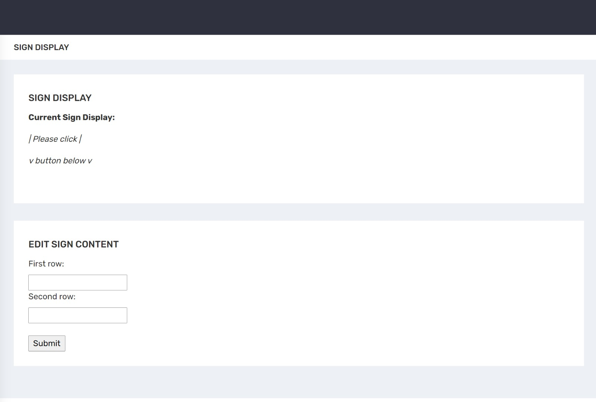
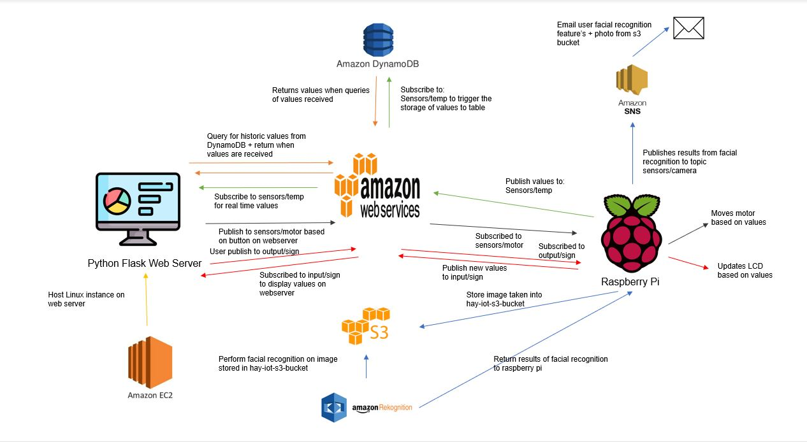
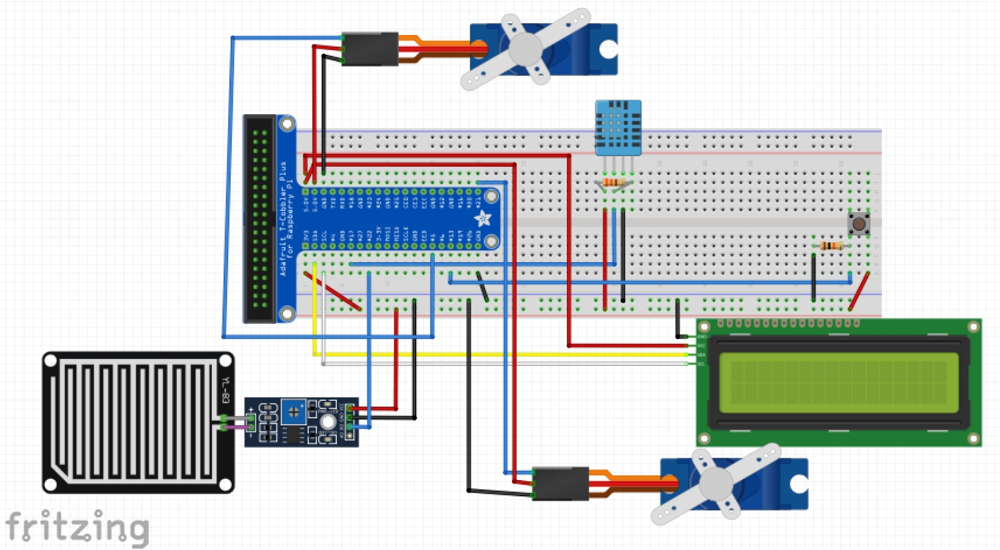

# HAY Smart Home & Lock Service
> HAY is a smart home and lock device which is capable of managing Internet Of Things (IOT) devices in the house and door. Our project utilises AWS cloud services, including but not limited to, AWS Rekognition, deploying web servers, S3 buckets.

[![NPM Version][npm-image]][npm-url]
[![Build Status][travis-image]][travis-url]
[![Downloads Stats][npm-downloads]][npm-url]

The purpose of our project is to create a home device that would interface with IOT devices with useful applications to any households. In the past, home owners were not able to have constant surveillance at the doorstep. However with HAY, home owners will be able to view any visitors or delivery men outside of their door upon a ring of a door bell. Home owners also frequently forget to close their windows resulting in rain pouring in on one unlucky afternoon. However, with our rain detector IOT device, upon detecting raindrops it will automatically close the windows of the house. Our solution makes use of AWS cloud solutions to conduct communications between the Raspberry PI and Python web server as well as utilises many other services in AWS.


## Table of Content
- [Installation](#Installation)
- [Usage](#Usage)
- [Web Application](#Web-Application)
- [System Architecture](#System-Architecture)
- [Network Setup](#Network-Setup)
- [AWS Functionalities](#AWS-Functionalities)
  * [IOT Core](#IOT-Core)
  * [S3](#S3)
  * [AWS Rekognition](#AWS-Rekognition)
  * [Dynamodb](#Dynamodb)
  * [EC2](#EC2)
  * [Simple Notification System](Simple-Notification-System)
- [Evidence For Basic Requirement](#Evidence-For-Basic-Requirement)
- [Bonus Feature](#Bonus-Feature)
- [Quick-Start Guide](#Quick-Start-Guide)
- [Physical Setup](#Physical-Setup)
- [Software Checklist](#Software-Checklist)
- [Software Setup Instructions](#Software-Setup-Instructions)
- [Task List](#Task-List)
- [References](#References)


## Installation

Raspberry Pi:

```sh
git clone https://github.com/potatoFry/IOTAssignment_2
```

Python Flask Server (Linux Machine):

```sh
git clone https://github.com/potatoFry/IOTAssignment_2
```

## Usage

A few motivating and useful examples of how your product can be used. Spice this up with code blocks and potentially more screenshots.

_For more examples and usage, please refer to the [Wiki][wiki]._

## Web Application

Index.HTML


Sign.HTML



## System Architecture



## Network Setup
* Raspberry PI
* EC2 Linux Machine
* MQTT AWS Broker


## AWS Functionalities

One of the objectives of this project was to make use of AWS cloud services to learn of their functionalities. The following are the various functionalities we have used and what they were used for.

### IOT Core

This is used for a majority of the main IOT features. The IOT Core service makes use of MQTT messages in order to send data between the EC2 instance and the Raspberry Pi.

### S3

The S3 Bucket allows our program to store images into it. In the context of our Smart Home System, these photos are taken when the button is clicked and then sent to the AWS S3 Bucket.

### AWS Rekognition

AWS Rekognition provides basic facial recognition technology, being able to distinguish faces and tell basic features such as facial hair or emotion. These features are sent to the house owner using the Simple Notification System.

### Dynamodb

The Dynamodb database allows the storing of basic values. We have used Dynamodb to store the values of temperature at different times in the day. The last 10 values are then displayed in the form of a graph on the web display.

### EC2

An EC2 instance was used to host the web server in the cloud. The EC2 instance is essentially a virtual machine hosted on the cloud so that it is not necessary to run it on the Raspberry Pi. 

### Simple Notification System

The Simple Notification System service allows sending of emails or messages to specific devices. This was used in the project to send homeowners emails whenever a visitor clicks a button. The email contains a picture of the visitor as well as details of the visitor that was obtained from Rekognition.

## Evidence for Basic Requirement
Requirement  | Evidence
------------- | -------------
Used three sensors  | Used DHT11, Button, LCD Screen,Rain Sensor, Tower Pro SG90 Servo
Used MQTT | Used MQTT to update real-time values on web server
Used Cloud Service | Used IOT Core, S3, AWS Rekognition, Dynamodb, EC2, SNS
Provide real-time sensor value / status | Shows real-time value of LED and Temperature sensor
Provide historical sensor value / status | Shows historical value of Temperature sensor
Control actuator | Controls Tower ProSG90 Servo motor from web server by button
## Bonus Feature
* Use of 6 actuators & sensors
* Use of 6 AWS Cloud services
* Control more than 1 actuator
* View more than 1 real-time state 

## Quick Start Guide
1. First connect hardware as in Section Physical Diagram
2. Run the server.py file for the web server in EC2
3. Run the main.py file in the RaspberryPI

## Physical Setup

The following parts were used in this project:

* DHT11
* Button
* I2C 16x2 LCD Screen
* YL-83 Rain Sensor - Control Board
* YL-83 Rain Sensor - Detection Board
* Tower Pro SG90 Servo
* One 330Ω and 10kΩ resistor
* Sufficient Wires

To emulate the project, you can set up the breadboard according to the diagram below.



## Software Setup Instructions
To utilise the application, we will need 1 Raspberry Pi as well as create a EC2 instance with a Linux operating system. The Raspberry Pi will be used to publish real time values such as temperature and humidity, as well as subscribed to topics that will change the LED screen. The EC2 instance will be used to run a python web server which allows users to view real time values from the Raspberry Pi as well as historic values. The python web server allows users to change and edit the LCD screen of the Raspberry Pi as well as.

Python Flask Server
```sh
python3.8 -m web-venv ~/WebServerDirectory #creating a virtual environment
source ~/WebServerDirectory/web-venv #activate the virtual environment
pip3 install boto3 flask AWSIoTPythonSDK
```

Raspberry Pi
```sh
python -m venv ~/RaspberryPiDirectory #creating a virtual environment
source ~/RaspberryPiDirectory/venv #activate the virtual environment
pip install AWSIoTPythonSDK botocore awscli
```

## Task List
Name of member | Part of project worked on | Contribution percentage
------------- | -------------  | -------------
Aloysius Junior  | Rain Detector to SNS message.
Controlling motor from webpage (RPI)| 33.3
Muhammad Harith | asdasd | 33.3
Yuki Kong | dasdasd | 33.3
## References

